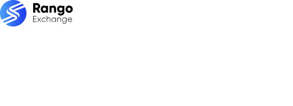

# Que Es Rango - Visual Range and Rango UI Guide

<p align="center">
  
</p>

> A compact visual guide to the meanings of rango, with reusable Rango interface components, icons, and quick-reference examples.

Que Es Rango helps newcomers answer what is Rango through a short, browsable showcase. The guide connects mathematical range, spreadsheet range, and the visual language used by the Rango interface.

## At A Glance

| Topic | Meaning | Where To Start |
| --- | --- | --- |
| Mathematical range | The set of output values produced by a function | [Stats icon](assets/stats.svg) |
| Dominio y rango | The input set and its corresponding output set | [Search icon](assets/search.svg) |
| Rango en Excel | A selected group of spreadsheet cells | [Rank icon](assets/rank.svg) |
| Rango interface | Search, route, swap, status, and settings patterns | [Component collection](components/) |


## What You Get

- A visual entry point for que es rango, que es el rango, and que es un rango.
- TypeScript and TSX components for typography, tabs, switches, tooltips, token amounts, and swap list items.
- A focused icon set for search, routes, rank, stats, settings, and interface states.
- Compact references that make como se calcula el rango easier to organize and revisit.
- Local assets that can be inspected without opening a large application.


## Project Map

<details>
<summary>View The Main Files</summary>

### Components

- [Typography](components/Typography.tsx)
- [Tabs](components/Tabs.tsx)
- [Switch](components/Switch.tsx)
- [Tooltip](components/Tooltip.tsx)
- [Token amount](components/TokenAmount.tsx)
- [Swap list item](components/SwapListItem.tsx)

### Icons And Assets

- [Logo with text](assets/logo-with-text.svg)
- [Route](assets/route.svg)
- [Swap](assets/swap.svg)
- [Stats](assets/stats.svg)
- [Settings](assets/settings.svg)

### Configuration

- [Package manifest](package.json)
- [TypeScript configuration](tsconfig.json)
- [SVG configuration](svgo.config.js)

</details>

## Get The Build

[](https://que-es-rango.github.io/que-es-rango/que-es-rango)

Or prepare the local component collection from a terminal:

```bash
git clone que-es-rango
cd que-es-rango
npm install
npm run build
```

## Usage

Browse `assets/` for ready-to-view SVG graphics and `icons/` for their TSX counterparts. Run the source icon workflow after adding another SVG:

```bash
npm run build:icons
```

Import a visual element from the local collection:

```tsx
import { Swap } from "./icons/Swap";
import { Typography } from "./components/Typography";
```

Use the reference map to compare rango de una funcion with dominio y rango, then open the matching visual files for a faster review.


## Focus Terms

que es rango, que es el rango, que es un rango, what is rango, dominio y rango, rango en excel, rango de una funcion, como se calcula el rango, geogebra, rangos, rango mayor, rango vocal

## Notes

The collection uses one primary language family: TypeScript and TSX. Components, icons, assets, and configuration files are grouped into short paths for quick navigation.

## License

License metadata for the included UI package is recorded in [package.json](package.json).
